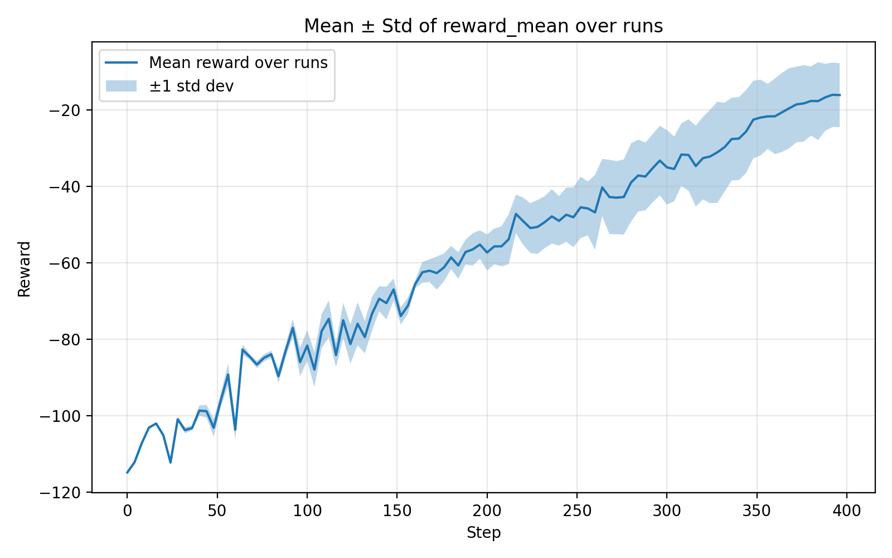
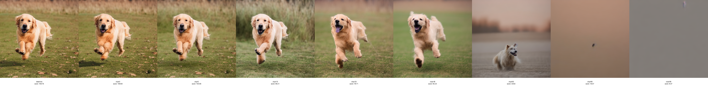

# DDPO-PyTorch

This project implements **DDPO (Diffusion Decision Policy Optimization)** for Reinforcement Learning.  
It is part of the **F25 RL Final Project** supervised by Prof. Mathieu Laurière.  

**Project Members:**  
- Ruixuan Li (rl4789)  
- Yanran Deng (yd2618)  
- Zhuoran Chen (zc2745)  
- Linxi Xie (lx2154)  


**Reference:** [ddpo-pytorch](https://github.com/kvablack/ddpo-pytorch.git)  

## Installation
Requires Python 3.10 or newer.

```bash
git clone https://github.com/joliachen/Fall25-Reinforcement-Learning-Final-Project.git
pip install -e .
```

## Usage
```bash
accelerate launch scripts/train.py --config config/dgx.py:compressibility
```

## Reward Curve


 Instructions:
```bash
    Export your WANDB table as wandb_export.csv and place it in:
    visualize_training/wandb_export.csv.
    Then run:
    python visualize_training/plot_mean_std.py
    
```


## Learned Trajectories


 Instructions:
```bash
    # generate and visualize the training traj
    python visualize_training/generate_training_trajectory.py
    python visualize_training/generate_training_strip.py
```
    
</details>

## Baseline Comparison
doc/trajectory_demo.html


Instructions:
```bash
    # Stable Diffusion trajectory 
    python visualize_inference/visualize_traj.py --checkpoint None

    # DDPO trajectory
    python visualize_inference/visualize_traj.py --checkpoint logs/<run>/checkpoints/checkpoint_XX

    # Then load the scores accordingly from trajectory_sd and trajectory_ddpo 
    python visualize_inference/load_scores.py

    # and paste the score list into doc/trajectory_demo.html

    # Open the following html with VSCode Live Server Extension
    doc/trajectory_demo.html
```


