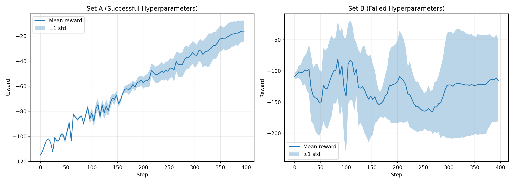
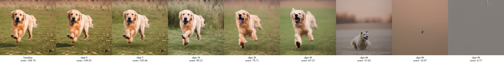
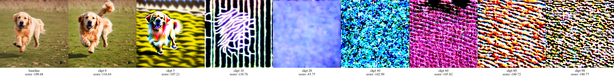

# DDPO-PyTorch

This project implements **DDPO (Diffusion Decision Policy Optimization)** for Reinforcement Learning.  
It is part of the **F25 RL Final Project** supervised by Prof. Mathieu Laurière.  

**Project Members:**  
- Rachel Li (rl4789)  
- Yanran Deng (yd2618)  
- Zhuoran Chen (zc2745)  
- Linxi Xie (lx2154)  


**Reference:** [ddpo-pytorch](https://github.com/kvablack/ddpo-pytorch.git)  

## Installation
Requires Python 3.10 or newer.

```bash
git clone https://github.com/joliachen/Fall25-Reinforcement-Learning-Final-Project.git
pip install -e .
```

## Usage
```bash
accelerate launch scripts/train.py --config config/dgx.py:compressibility
```

## Reward Curve
Reward / compression score across timesteps. The DDPO working configuration (Set A) steadily improves over baseline SD, while Set B shows unstable or slower progress. Shaded regions indicate one standard deviation across five seeds.



 Instructions:
```bash
    # Export your WANDB table as wandb_export.csv and place it in:
    visualize_training/wandb_export.csv.
    # Then run:
    python visualize_training/plot_mean_std.py
    
```


## Learned Trajectories
Row 1: SD baseline. Row 2: SD+DDPO (Set A, working). Row 3: SD+DDPO (Set B, non-working). DDPO with Set A produces smooth transitions and coherent latents, while Set B exhibits artifacts and inconsistent denoising. 
We use the checkpoint saved at epoch 50 for
both Set A and Set B and visualize the full 50-step denoising process at inference time. 


## Checkpoint Progression
Training progression for DDPO (Set A, working).



Training progression for DDPO (Set B, non-working).



 Instructions:
```bash
    # generate and visualize the training traj
    python visualize_training/generate_training_trajectory.py
    python visualize_training/generate_training_strip.py
```
    
</details>


